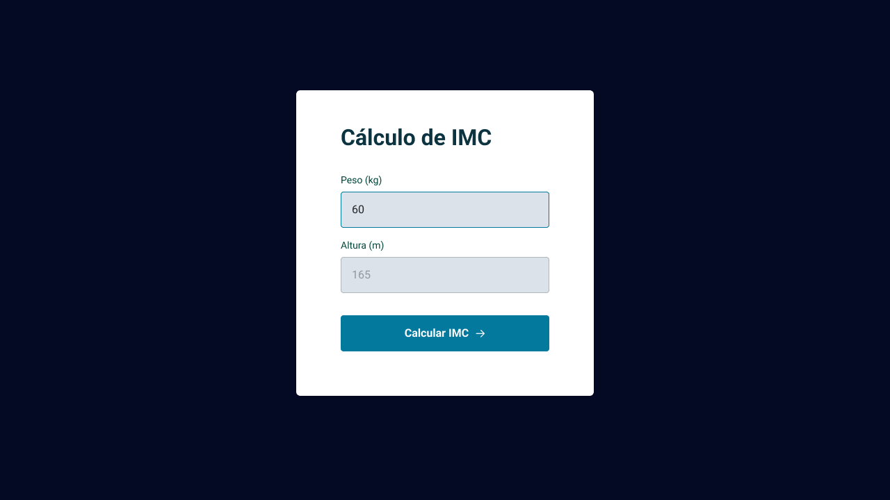

<h1 align="center"> Calculadora de IMC </h1>

  <a href="#-tecnologias">Tecnologias</a>&nbsp;&nbsp;&nbsp;|&nbsp;&nbsp;&nbsp;
  <a href="#-projeto">Projeto</a>&nbsp;&nbsp;&nbsp;|&nbsp;&nbsp;&nbsp;
  <a href="#-layout">Layout</a>&nbsp;&nbsp;&nbsp;|&nbsp;&nbsp;&nbsp;

 

## 🚀 Tecnologias

Esse projeto foi desenvolvido com as seguintes tecnologias:

- Estrutura de dados HTML
- CSS
- Funções no Javascript
- Manipulação da DOM
- Biblioteca JS Math()
- Funções *callback*
- Figma

## 💻 Projeto

Calcuradora de IMC.

- [Acesse o projeto finalizado, online](https://jhonimattos.github.io/calculadoraimc).

## 🔖 Layout

Você pode visualizar o layout do projeto através [DESSE LINK](https://www.figma.com/design/JFcRpybOaJnQXF1hoLpuH7/IMC-(Copy)?node-id=6-4&t=BIdoGf6QPsOvOKQO-0) para acessá-lo.